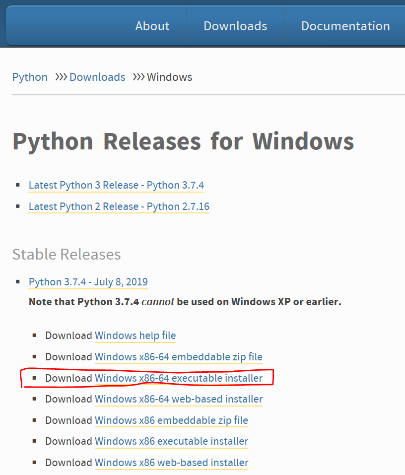

# Python はじめの一歩

## 1. 準備

### 1.1 Pythonのインストール

https://www.python.org/downloads/windows/

Pythonのインタプリタをインストールする。

1. 上記のURLから，64bit版のPython3 インストーラをダウンロードする。

   

2. ダウンロードしたインストーラを起動してインストールする。

   

   

3. インストールできたら，`cmd`か`PowerShell`を開いて，次のコマンドを実行し，インストールしたPython v3.7.4が起動できることを確認する。終了するには`quit()`を入力する。
   ```bat
   PS C:\Users\ywagu\Desktop> py
   Python 3.7.4 (tags/v3.7.4:e09359112e, Jul  8 2019, 20:34:20) [MSC v.1916 64 bit (AMD64)] on win32
   Type "help", "copyright", "credits" or "license" for more information.
   >>> quit()
   PS C:\Users\ywagu\Desktop>
   ```

### 1.2 PyCharmのインストール

https://www.python.org/downloads/windows/

PyCharmはPythonの統合開発環境(IDE)。

1. 上記のURLからインストーラを取得する。有料のProfessional版と無料のCommunity版があるので，Community版をダウンロード。

   

2. ダウンロードしたインストーラを実行してインストールする。

   

   インストールしたいフォルダを選択してNext。ここで選択したフォルダは1.3で使用するため覚えておく。

   

   デスクトップにショートカットを作成したい場合は左上の64-bit launcherをチェックする。

   

   

   Run PyCharm Community Editionをチェックして，起動するか確認する。

   

   

   

   下記の画面が表示されればインストールは無事完了。

   

### 1.3 (Optional) PyCharmの日本語化

http://mergedoc.osdn.jp/

PyCharmの日本語化を行うため，Pleiadesのプラグインをインストールする。(任意)

1. 上記のURLからPleiadesプラグインをダウンロードする。

   

2. ダウンロードしたzipを解凍し，setup.exeを実行する。日本語化するアプリケーションで，`<1.2節でPyCharmをインストールしたフォルダ>\bin\pycharm64.exe`を選択する。

   

3. PyCharmを起動し，下記のように日本語化されていれば無事完了

   

## 2. CLI(Command Line Interface)アプリケーション

それではPyCharmを使って，Command Line Interfaceのアプリケーションを作ってみよう。

### 2.1 PyCharmの使い方：こんにちは世界

1. PyCharmを起動して，新規プロジェクトを作る。

   

   「ロケーション」の最後のディレクトリ(プロジェクト名)を「helloworld」にする。

   

2. プロジェクトを作成したら，右クリックから新規のPythonファイルを作成する。

   

   ファイル名は「helloworld」

   

3. プログラムを書く

    作成したPythonのファイルに以下のプログラムを書く。

    ```python
    print("Hello 'Python' World!")
    ```

4. プログラムを実行する

   右クリックのメニューの中に「実行」があるので実行する。

   

   実行すると，PyCharmの画面の下に以下のようなWindowが出る。「Hello 'Python' World!」が出力されていれば正常。

   

### 2.2 練習問題1：標準入力と標準出力

Pythonで標準入力から入力を受け取るには`input`関数を使う。標準出力に出力するには`print`関数を使う。

例：
```python
print("何か入力してください: ", end="")
input_string = input() #ここでキーボードの入力待ちになる
print(input_string) #入力した文字列が出力される
```

- 練習問題1

  名前を入力すると，「こんにちは，<入力した名前>」と出力するプログラムを作ってみよう。

- 回答例

  https://github.com/ywag/python-firststep-guide/tree/master/practice1
  

### 2.3 練習問題2：配列と繰り返しと条件分岐

配列へのアクセス，for文による繰り返し，if文による条件分岐の例。

```python
mylist = [1,2,3,4,5]
print(mylist)          #=>[1,2,3,4,5]
print(mylist[0])       #=>1
print(mylist[1:3])     #=>[2,3]
mylist.append(6)       #末尾に6を追加する
print(mylist)          #=>[1,2,3,4,5,6]

for i in mylist:       
    print(i, end=" ")  #=>1 2 3 4 5 6 

for i in range(10):    #0～9の範囲で
    print(i, end=" ")  #=>0 1 2 3 4 5 6 7 8 9 

for i in range(6):
    if mylist[i] % 2 == 0:         #中身が偶数だったら
        print(mylist[i], end=" ")  #=>2 4 6
```

- 練習問題2

  標準出力から数値を入力し，フィボナッチ数列の入力した数値の項を出力するプログラムを作ってみよう。  
  フィボナッチ数列とは，下記のように，第1項と第2項が1，第3項以降は，前二つの項の和である数列のことである。
  
  フィボナッチ数列：
  ```
  1, 1, 2, 3, 5, 8, 13, 21, 34, ・・・
  ```

  プログラム実行例：
  ```
  数値を入力してください： 9
  フィボナッチ数列の第9項は34です。
  ```

- 回答例

  https://github.com/ywag/python-firststep-guide/tree/master/practice2

## 3. Webアプリケーション

### 3.1 通信の仕組み

アプリケーションをインストールして使うのではなく，Web上で様々な機能を提供する形態のアプリケーションをWebアプリケーションと呼ぶ。例えばブラウザからアクセスするようなゲーム，銀行のインターネットバンキング，Twitter等のSNSなど。

これらWebアプリケーションとは，個々人のPCにアプリケーションをインストールするわけではなく，サービスを提供している会社のサーバマシンに入っている。個々人のPCからブラウザでアクセスすると，裏でネットワーク通信を行い，サーバにデータを要求するメッセージを送信し，サーバからはブラウザが表示できる形のレスポンス(例：HTML(Hyper Text Markup Language))が返信されてくる。この通信に使われている通信規約(プロトコル)の代表がHTTP(Hyper Text Transfer Protocol)である。

HTMLやHTTPについては下記あたりを参照。
- https://www.kanzaki.com/docs/html/lesson1.html
- https://viral-community.com/other-it/http-1873/
- https://www.atmarkit.co.jp/ait/articles/1703/29/news045.html

Pythonでは，Webアプリケーションを作成するための様々なフレームワークやライブラリがある。ここではFlaskというフレームワークを使ったWebアプリケーション作成を紹介する。

### 3.2 Web版こんにちは世界

ブラウザ上に文字列を表示するWebアプリケーションを作る。

1. Flaskとrequestのインストール

   「ファイル」のメニューから「設定」を選択する。

   

   「プロジェクト・インタープリター」を選択し，右の「+」ボタンを押す。

   

   「flask」で検索し，「Flask」を選択して「パッケージのインストール」ボタンを押す。

   

   さらに「request」で検索し，「request」もインストールする。
  
   

   正常にインストールできていると，下記の画面になる。

   

2. 新規にPythonのファイルを作成し，以下のプログラムを記載する。

   ```python
   from flask import Flask
   app = Flask(__name__) #オマジナイ


   @app.route('/')  #「/」にアクセスした場合に実行する
   def hello():
       return "Hello 'Web Application' World!"


   if __name__ == "__main__": #オマジナイ
       app.run()
   ```

   実行すると下記のように表示される。最後の行にある通り，http://127.0.0.1:5000/ にブラウザでアクセスしてみよう。ブラウザに「Hello 'Web Application' World!」が表示されていれば正常に動作している。

   ```bat
   C:\Users\ywagu\PycharmProjects\helloworld\venv\Scripts\python.exe C:/Users/ywagu/PycharmProjects/helloworld/webhelloworld.py
    * Serving Flask app "webhelloworld" (lazy loading)
    * Environment: production
      WARNING: This is a development server. Do not use it in a production deployment.
      Use a production WSGI server instead.
    * Debug mode: off
    * Running on http://127.0.0.1:5000/ (Press CTRL+C to quit)
    ```

    この文字列が表示されるまでには，下記のような処理を行っている。
 
    1. ブラウザにhttp://127.0.0.1:5000/ を入力する
    2. ブラウザは127.0.0.1のサーバ(実態はローカルホスト，自分のPC)の5000番ポートに接続する
    3. ブラウザはサーバに以下のようなHTTPのリクエストメッセージを送信する
       ```http
       GET / HTTP/1.1
       Accept: */*
       Accept-Encoding: gzip, deflate
       Connection: Keep-Alive
       Host: 127.0.0.1:5000
    
       ```
    4. サーバはHTTPリクエストメッセージを受信し，Pythonのプログラムを実行する。
    5. サーバはPythonのプログラムを実行した結果を以下のHTTPのレスポンスメッセージとして返信する。
       ```http
       HTTP/1.1 200 OK
       Date: Sun, 11 Aug 2019 12:05:18 GMT
       Content-Length: 30
       Content-Type: text/plain; charset=utf-8

       Hello, 'Web Application' World!
       ```
    6. ブラウザはレスポンスメッセージを受信し，画面に受信した文字列を表示する。

### 3.3 練習問題3：Web版入力と出力

- 練習問題3

  入力から名前を受け取り，「こんにちは，<名前>」を出力するWebアプリケーションを作る。
  以下の内容に従ってWebアプリケーションを作ってみよう。動作するアプリケーションは下記にある。

  https://github.com/ywag/python-firststep-guide/tree/master/practice3


 1. 右クリックから新規に「templates」ディレクトリを作る。
 2. 名前を入力する画面をHTMLで作成する。
  
    画面イメージ：

    
  
    templates以下に「input.html」ファイルを作成し，次のHTMLを記載する。「名前」のフォームに入れた文字列が，「name」パラメータとしてサーバに送信される。「送信」ボタンを押すと「/practice3/output」へアクセスする。

     ```html
     <!DOCTYPE html>
     <html lang="ja">
       <head>
         <meta charset="UTF-8">
         <title>Sample Web Application</title>
       </head>
       <body>
         <h1>名前を入力してください</h1>

         <form action="/practice3/output" method="post">
           <p>
             名前：<input type="text" name="name" size="40" />
           </p>
           <p>
             <input type="submit" value="送信" /><input type="reset" value="リセット" />
           </p>
         </form>
       </body>
     </html>
     ```

 3. プログラムを作成する。

    ```python
    from flask import Flask, render_template, request
    app = Flask(__name__)


    @app.route('/')
    def hello():
        return "Hello 'Web Application' World!"


    @app.route('/practice3/input') #「/practice3/input」にアクセスされた場合に，名前入力画面を返す
    def input_name():
        return render_template('input.html')


    @app.route('/practice3/output', methods=["POST"]) #「/practice3/output」にアクセスされた場合に，nameパラメータに入力された名前を使って文字列を組み立てて返す
    def output_name():
        return "こんにちは、" + request.form['name']


    if __name__ == "__main__":
        app.run()

     ```

 4. プログラムを実行する

    プログラムを実行し，http://127.0.0.1:5000/practice3/input へアクセスしてみよう。

### 3.4 応用
 1. カレンダーを表示するWebアプリケーションを作ってみよう
 2. TODOリストを表示するWebアプリケーションを作ってみよう
 